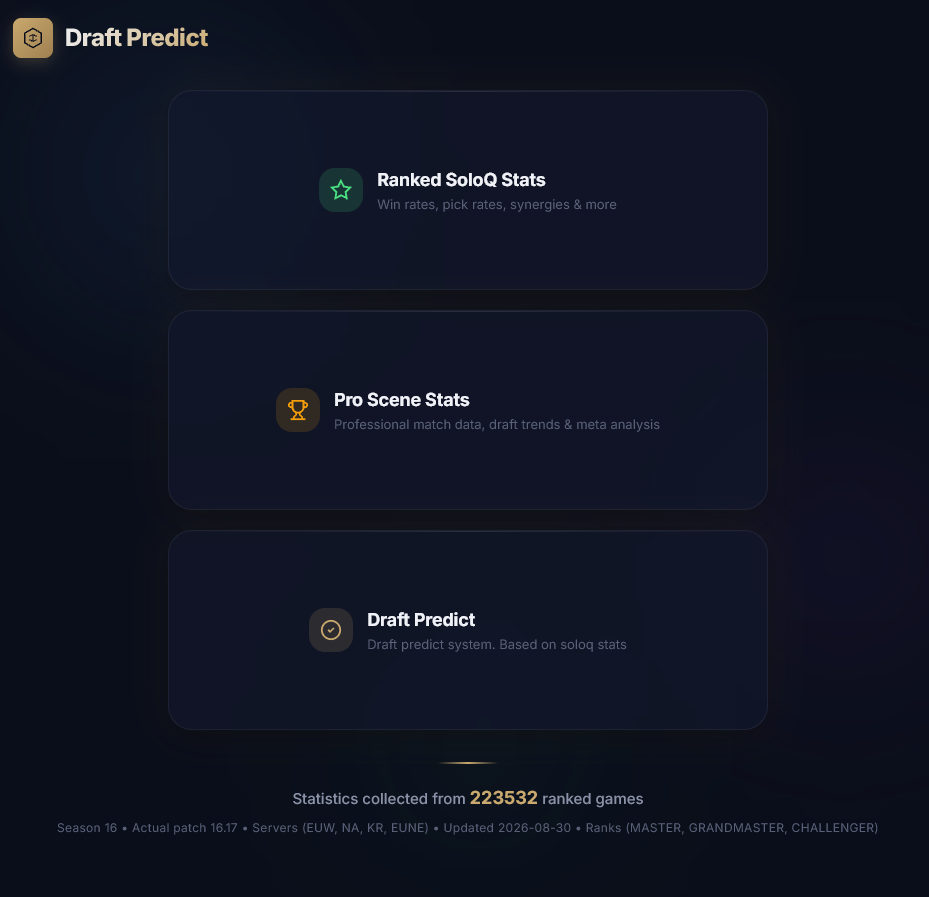
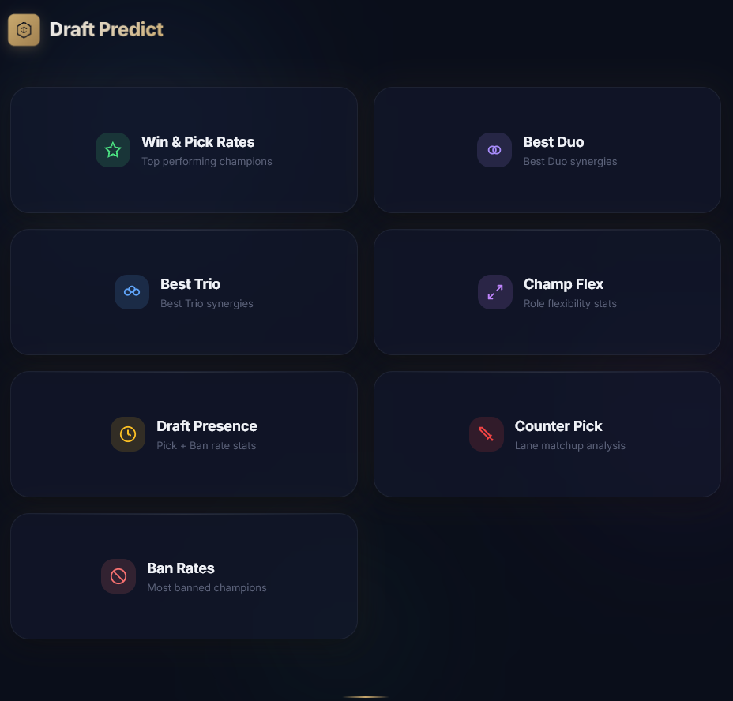
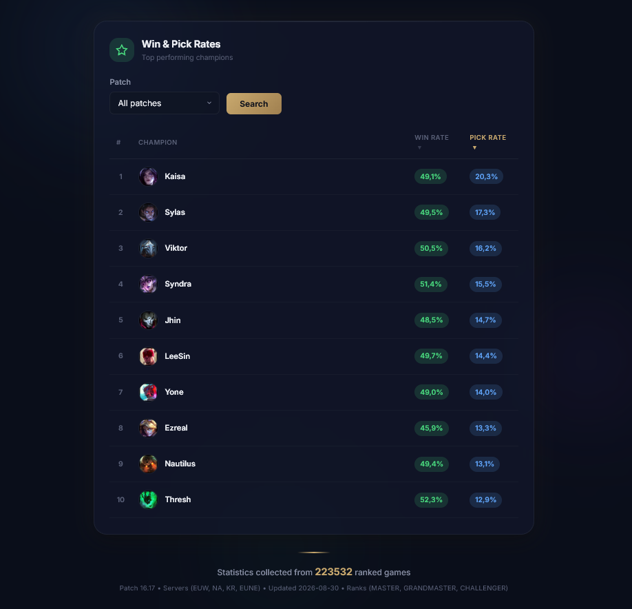
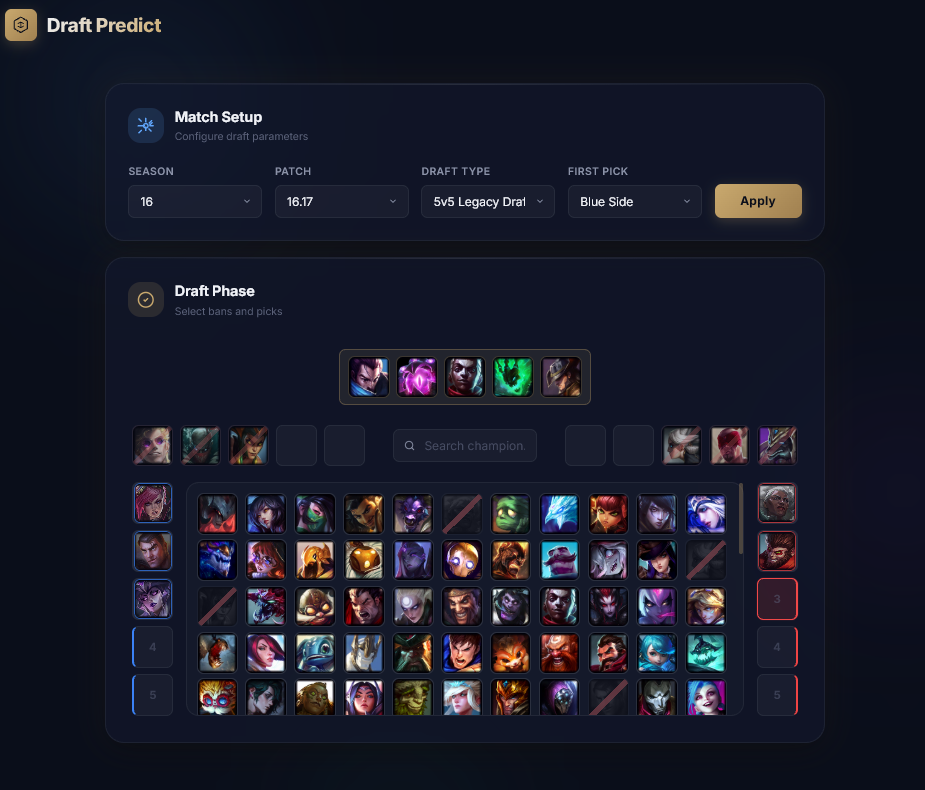

# 🎯 Draft Predictor

A League of Legends analytics platform that collects ranked match data from the Riot API, processes champion draft information, and builds a **statistical champion draft recommendation system** based on real match patterns.

🔗 [http://194.33.35.224:8083/lol/main](http://194.33.35.224:8083/lol/main)

---

## 📖 About the Project

Draft Predictor is a data-driven analytics platform for League of Legends. It automatically gathers ranked SoloQ match data via the Riot API, extracts both basic match parameters and detailed timeline events, and uses this information to build a **statistical recommendation engine** that suggests optimal champion drafts.

The core idea is simple: instead of relying on intuition, the system analyzes thousands of matches to discover real patterns — champion synergy, pick/ban rates, win rates, counter-picks, role flexibility, and timeline-based power spikes — and turns them into actionable draft recommendations powered by constraint propagation and statistical scoring.

---

## 📸 Screenshots

<p align="center">
 
 
 
 
</p>

---

## ✨ Features

### 📊 Data Collection Pipeline
*   **Automated Ingestion:** Scheduled daily collection of SoloQ ranked matches via the Riot API using Spring `@Scheduled` — runs hands-free.
*   **Multi-stage Pipeline:** Separate stages for PUUID gathering, match ID discovery, match info extraction, and persistence (`GatherPUUID` → `GatherMatchIDs` → `GatherMatchInfo` → `SaveMatchInfo`).
*   **Regional Routing:** Dedicated `WebClient` configurations for different Riot regions (EUROPE, ASIA, AMERICAS, SEA).
*   **Timeline Extraction:** Extended match parameters including gold/XP graphs, power spikes, and early/mid/late game transitions.

### 🧠 Statistical Recommendation Engine
*   **Performance Analytics:** Win rates, pick/ban rates, draft presence, and champion flexibility scoring per role.
*   **Counter-pick Detection:** Recommendations based on win-rate differentials against specific champions.
*   **Synergy Analysis:** Best duo / best trio detection for top side & bot side compositions.
*   **Constraint Propagation:** Role inference algorithm that resolves ambiguous champion-role assignments through iterative constraint solving.
*   **In-memory Caching:** Fast recommendation lookups via `ConcurrentHashMap`-based stateful cache.

### 🗄️ Database & Analytics
*   **Native SQL Queries:** Complex analytical queries for pick rates, win rates, synergy, and flexibility metrics.
*   **Materialized Views:** Precomputed statistical aggregates (`flex_stats`, `flex_agg`, `flex_avg`) with scheduled refresh for fast reads.
*   **Database Indexes:** Indexes on frequently queried columns (`champion`, `position`, `match_id`, `patch`) to improve query performance.
*   **Versioned Schema:** All database migrations managed via **Flyway** — no `ddl-auto` in production.

### 🎨 Interactive Frontend
*   **Dynamic Draft Board:** Built with HTML5 Canvas for smooth champion visualization.
*   **Real-time Data Fetching:** Fetch API for asynchronous communication with the backend.
*   **Rich Filtering:** Champion icons, role filters, patch selectors, and region filters.
*   **Responsive UI:** Vanilla JavaScript + CSS with no heavy frontend frameworks.

### ⚙️ Background Processing & Monitoring
*   **Scheduled Jobs:** Automated data collection, materialized view refresh, and cache updates.
*   **Logging:** Logback-based application logging.

## 🏗️ How It Works
1.  **Scheduled Ingestion:** A Spring `@Scheduled` job triggers the daily pipeline, which walks through the Riot API to collect fresh SoloQ match data.
2.  **HTTP Requests:** `WebClient` is used to communicate with the Riot API and handle regional routing.
3.  **Persistence & Migration:** Parsed data is stored in PostgreSQL within Spring-managed transactions (`@Transactional`). Schema evolution is handled by Flyway.
4.  **Analytical Aggregation:** Native SQL queries and materialized views compute statistics (win rates, synergy, counter-picks, flexibility).
5.  **Recommendation Engine:** The `DraftPredictService` applies constraint propagation and statistical scoring to produce draft suggestions.
6.  **Visualization:** The Canvas-based frontend renders the draft board and displays real-time recommendations to the user.

---

## 🛠️ Tech Stack

| Layer | Technology |
| --- | --- |
| **Backend** | Java 21, Spring Boot, Spring MVC, Spring Data JPA |
| **HTTP Client** | Spring WebClient |
| **Database** | PostgreSQL (native SQL, materialized views, indexes) |
| **Migrations** | Flyway |
| **Scheduling** | Spring `@Scheduled` |
| **Caching** | In-memory `ConcurrentHashMap` |
| **Frontend** | Thymeleaf, HTML5, CSS3, JavaScript, Canvas, Fetch API |
| **External API** | Riot Games API (multi-region) |
| **Monitoring** | Logback |
| **DevOps** | Docker |
| **Testing** | JUnit, AssertJ |

---

## 🔮 Roadmap

### ✅ Current State
*   SoloQ ranked match data collection via Riot API.
*   Timeline-based analytics and materialized view aggregation.
*   Statistical draft recommendation engine with constraint propagation.
*   Interactive Canvas-based draft board UI.

### 🚧 Planned
*   **Pro Match Data Collection** — extend the pipeline to gather data from professional League of Legends matches (LCK, LEC, LPL, LCS, etc.).
*   **Hybrid Recommendations** — combine SoloQ and pro-scene statistics to produce more meta-aware draft suggestions.
*   **ML-based Enhancement** — introduce machine learning models on top of the existing statistical foundation to refine recommendations beyond pure aggregation.
*   **Caching Improvements** — replace the current in-memory cache with Caffeine for TTL and eviction; consider Redis for shared caching in multi-instance deployments.
*   **CI/CD Pipeline** — GitHub Actions for automated testing, building, and Docker image deployment.

---

## 📦 Local Setup

### 1. Clone the repository
```
git clone https://github.com/kv3rk/draft-predict.git
cd draft-predict
```
### 2. Configure application properties
```
src/main/resources/application.properties
```
### 3. Run the application
```
Run the application
```
> ⚠️ A valid Riot Games API key is required to fetch match data.

---

## 📄 License
This project is built for educational and analytical purposes.
League of Legends and Riot Games are trademarks of Riot Games, Inc.

---

<div align="center">
<i>Built with ❤️ and a lot of ranked games</i>
</div>